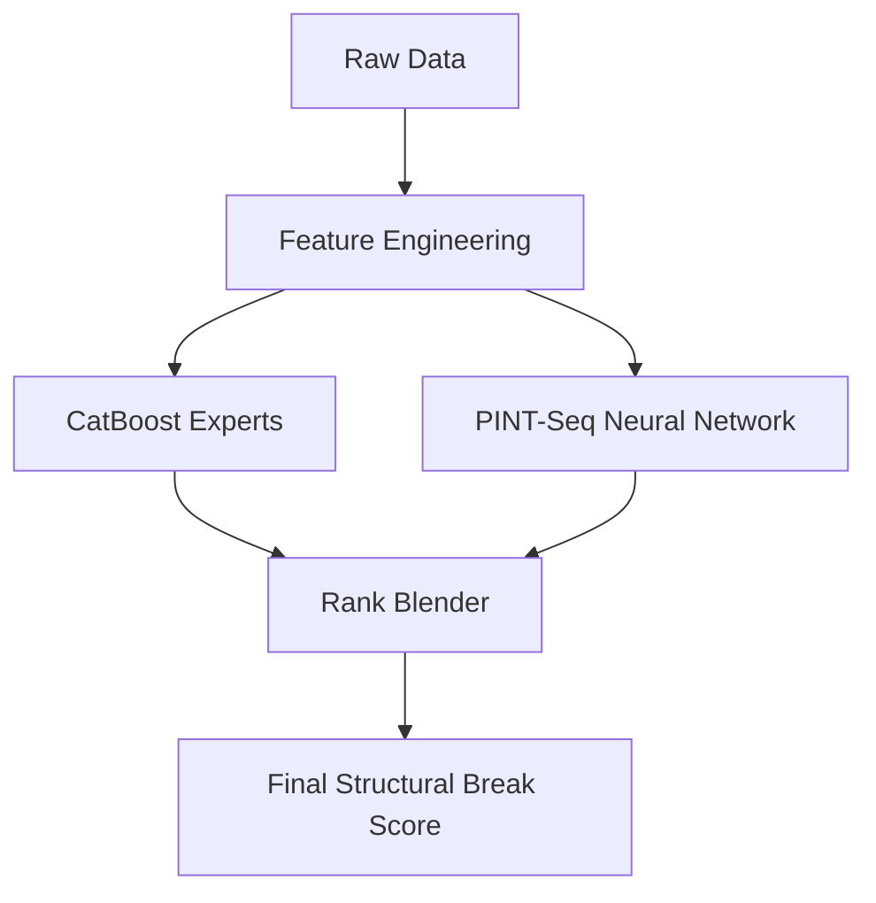

# Structural Break Complete — by CONDOR

This repository contains the full, state-of-the-art implementation of the structural break detection system developed by **CONDOR** for the CrunchDAO Structural Break Open Benchmark.

## Overview

The Complete version represents our most advanced solution, combining traditional boosting experts with cutting-edge neural architectures. It features a sophisticated ensemble that integrates:

1.  **CatBoost Windowed Models**: Captures local non-linear patterns across multiple time horizons.
2.  **PINT-Seq (Parallel Interactive Neural Transformers for Sequences)**: An attentional neural network designed specifically for financial sequence data.
3.  **Advanced Rank Blending**: An optimized Dirichlet-based blending strategy to maximize ROC AUC.

## Key Features

- **Full Ensemble**: A powerful combination of Boosting and Transformers.
- **PINT-Seq v3.0**: Our latest optimized neural architecture for sequence modeling.
- **Structural Break Expertise**: Specifically tuned for the ADIA Lab and CrunchDAO benchmark.
- **91.00% AUC**: This system achieved an outstanding 91.00% AUC, placing us in the Top 6 worldwide.

## Installation

```bash
pip install -r requirements.txt
```

*Note: Requires PyTorch for PINT-Seq components.*

## Usage

```python
import pandas as pd
from main import run_complete_inference

# Load your data
X_test = pd.read_parquet("data/X_test.parquet")

# Run the full ensemble inference
results = run_complete_inference(X_test)
print(f"Ensemble Prediction: {results['break_score']}")
```

## Architecture



## Authors

Developed by **CONDOR** — Sovereign Intelligence.
Visit us at [condor.qaibit.com](https://condor.qaibit.com)

## License

MIT License
